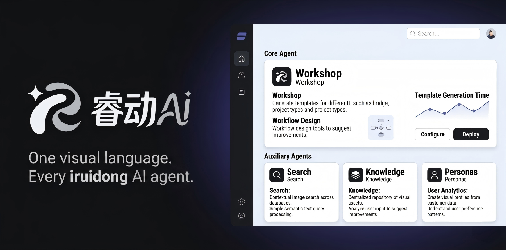

<div align="center">



# ruidong-ui-studio

**简体中文** · [English](./README.md)

### 一套可复用的 UI/UX 风格库，让睿动 AI 的每一个智能体看起来像同一个团队做出来的。

一个 [Claude Code](https://docs.claude.com/en/docs/claude-code/overview) plugin。装上之后，让 Claude 按睿动沉淀下来的**成熟视觉风格**生成前端界面代码 —— 不再每次新项目都从零辩论配色、字体、组件。

[](./LICENSE)
[](https://docs.claude.com/en/docs/claude-code/plugins)
[](./CHANGELOG.md)
[](#-当前收录的风格)

</div>

---

## 它解决什么问题

每次开一个新的睿动智能体项目，同一套问题就要从零讨论一遍：

- 用什么字体？用什么主色？侧边栏做深色还是浅色？
- 卡片要不要加阴影？圆角多大？hover 态怎么反应？
- 怎么让 Claude 生成的代码风格和我们其他产品对齐？

**本质上这些问题早就有答案了** —— 只是每次都散在各个项目的 `tailwind.config.js` 和组件文件里，没有归档，没有复用路径。

`ruidong-ui-studio` 把这些答案沉淀为 Claude Code plugin：**装一次，所有后续的睿动智能体项目都能直接调用同一套风格**。

---

## 🎨 设计气质速览

> **冷静、聪明、轻盈的专业工作台。**

当前唯一收录的风格 [`smartsolu-linear`](skills/ruidong-ui/styles/smartsolu-linear/) 融合了三个业界标杆：

| 学哪里 | 用于 |
|---|---|
| **Notion** 的骨架 | 信息组织、阅读舒适度、卡片布局、留白 |
| **Linear** 的质感 | 精致阴影、微妙渐变、状态过渡、深色侧边栏 |
| **Raycast** 的浮层 | 毛玻璃、悬浮层、轻盈感 |

配色 token 精简到极致：

```
bg-canvas      #f7f8fc    页面底色（微蓝灰，非纯白）
text-ink       #1a1d2e    主文字（深色，非纯黑）
bg-accent      #5e6ad2    唯一强调色（Linear 靛蓝紫）
border-edge    #e6e9f0    极淡描边
```

字体：**Plus Jakarta Sans**（英文）+ **Noto Sans SC**（思源黑体）。
坚决不用 Inter（用户真实审美反馈：太硬）。

---

## ⚡ Quick Start

前提：已安装 [Claude Code](https://docs.claude.com/en/docs/claude-code/overview)。

```bash
# 1. 拉仓库
git clone https://github.com/Rubbish0-A/ruidong-ui-studio.git

# 2. 在 Claude Code 里注册为本地 marketplace
/plugin marketplace add /path/to/ruidong-ui-studio

# 3. 安装
/plugin install ruidong-ui@ruidong-ui-studio

# 4. 重启 Claude Code
```

然后在**任意**睿动智能体项目里说：

> "帮我做一个侧边栏，按睿动风格"
>
> "给我一个符合睿动 UI 的主按钮"
>
> "用 SmartSolu 同款，写一个新智能体的起手模板"

Claude 会自动激活 `ruidong-ui` skill，按内置规范生成代码。

---

## 它是怎么工作的

这不是"一份大文档让 Claude 一次读完"，而是**按需加载**的分层知识库：

```
第一层：skill 激活 → 只读 SKILL.md（~70 行）+ QUICKREF.md（~45 行）
                   → 80% 的简单请求到这里就够了（按钮、卡片、Toast）

第二层：需要具体组件 → 按需读 components/buttons.md / sidebar.md / ...
                    → 每个文件 <90 行

第三层：需要完整设计哲学 → 读 PHILOSOPHY.md / TOKENS.md / 完整样例
```

**为什么这样拆？** 因为 Claude 的上下文是稀缺资源。一次塞 700 行进去，可用的上下文空间就少了一大截。这个拆分在简单请求上省 90% 上下文，复杂请求上多一次 Read 也值得。

---

## 🧩 当前收录的风格

| 风格 ID | 一句话叙事 | 来源 | 状态 |
|---|---|---|---|
| [`smartsolu-linear`](skills/ruidong-ui/styles/smartsolu-linear/) | 冷静、聪明、轻盈的专业工作台。Notion 骨架 + Linear 质感 + Raycast 浮层。 | SmartSoluExpert v1.6.0 生产风格 | 稳定 |

未来加入更多风格的流程见 [CONTRIBUTING](skills/ruidong-ui/CONTRIBUTING.md)。

---

## 项目结构

```
ruidong-ui-studio/
├── .claude-plugin/                 Plugin 清单（Claude Code 原生识别）
│   ├── plugin.json
│   └── marketplace.json
├── skills/
│   └── ruidong-ui/                 核心 skill
│       ├── SKILL.md                入口：选风格 + 工作流程
│       ├── PRINCIPLES.md           跨风格共通的元原则（底线）
│       ├── CONTRIBUTING.md         如何新增风格
│       └── styles/
│           └── smartsolu-linear/
│               ├── QUICKREF.md     一页纸速查（Claude 首选加载）
│               ├── PHILOSOPHY.md   三源融合叙事、绝不做的事
│               ├── TOKENS.md       色/字/阴影/圆角完整令牌
│               ├── components/     按组件类别拆分
│               │   ├── buttons.md
│               │   ├── cards.md
│               │   ├── inputs.md
│               │   ├── overlay.md  顶栏 + 弹窗 + Toast
│               │   ├── sidebar.md
│               │   └── misc.md
│               ├── tailwind.config.js
│               ├── fonts.html
│               └── examples/       完整 tsx 样例
├── evals/                          触发 eval 基线（维护者用）
├── install.ps1 / install.sh        备选安装脚本（非 Claude Code 环境）
├── CHANGELOG.md
└── LICENSE
```

---

## 哲学：什么坚决不做

[`PRINCIPLES.md`](skills/ruidong-ui/PRINCIPLES.md) 里列了跨风格的底线。几条你能感受到的：

- **绝不用 Inter** —— 来自真实用户反馈："Inter 太硬"；睿动需要更温暖、更几何圆润的字体
- **主内容区禁用毛玻璃** —— 毛玻璃只出现在 Overlay 层（顶栏 / 弹窗 / Toast / 下拉）
- **一屏视觉重点 ≤ 1 个** —— 多焦点会破坏"冷静工作台"气质
- **全产品只有 1 个主强调色** —— 画面 85%+ 由中性色承担
- **动效时长 ≤ 400ms** —— 动效是"状态切换顺手"，不是"看见动画"

这些不是装饰性建议 —— 每条都写进了 SKILL.md，Claude 生成代码时会遵守。

---

## 🧭 路线图

**短期**（当前 plugin 内扩展）

- [ ] 加更多风格（`<来源>-<气质>` 命名约定，详见 [CONTRIBUTING](skills/ruidong-ui/CONTRIBUTING.md)）
- [ ] 加 "组合场景 recipe"：完整登录页 / 管理后台 / 对话界面等"一次成形"级别的代码样例
- [ ] 加 `/ruidong-new-agent` slash command：一键起手新智能体项目
- [ ] 加 `/ruidong-ui-audit` slash command：审计已有项目是否符合规范

**中期**（marketplace 扩展）

- [ ] 独立 plugin：`ruidong-agent-sdk`（睿动 API 接入规范）
- [ ] 独立 plugin：`ruidong-deploy`（睿动平台部署工作流）

---

## 🤝 贡献

想加一个新的风格？看 [CONTRIBUTING](skills/ruidong-ui/CONTRIBUTING.md)。

每个新风格必须提供：

- `QUICKREF.md`（速查卡）
- `PHILOSOPHY.md`（叙事 + 底线）
- `TOKENS.md`（完整令牌）
- `components/`（拆分的组件片段）
- `tailwind.config.js` + `fonts.html`（可复制的配置）
- `examples/`（完整样例）

PR 欢迎。Issue 也欢迎（即使只是"这里写得不清楚"）。

---

## 适用范围

**适合**

- 睿动内部同事做新智能体项目的 UI 起点
- 客户交付类产品需要统一视觉气质
- React + Tailwind 的前端项目（当前风格主要针对此栈）

**不适合**

- 面向 C 端的娱乐 / 社交产品（当前风格偏克制专业）
- 纯展示型 / 单页营销网站（当前是工作台气质）
- 需要鲜艳明亮色彩的儿童 / 教育类产品

---

## License

[MIT](./LICENSE) © 2026 [Andy Chen](https://github.com/Rubbish0-A) / Ruidong AI

---

## 致谢

- 风格灵感来自 [Linear](https://linear.app) / [Notion](https://notion.so) / [Raycast](https://raycast.com) 三家对"精致但克制"有深刻理解的产品团队
- 基于 [Claude Code](https://docs.claude.com/en/docs/claude-code/overview) / [Anthropic Agent Skills](https://docs.claude.com/en/docs/claude-code/agent-skills) 协议构建
- 首个风格抽象自生产项目 **SmartSoluExpert v1.6.0** —— 在多轮真实客户使用中打磨出来的审美判断

<div align="center">

**让每一个睿动智能体看起来都像同一个团队做的。**

[快速安装 ↑](#-quick-start) · [查看风格 →](skills/ruidong-ui/styles/smartsolu-linear/) · [贡献指南 →](skills/ruidong-ui/CONTRIBUTING.md)

</div>
